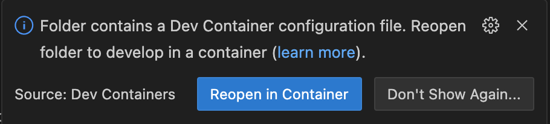
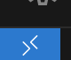
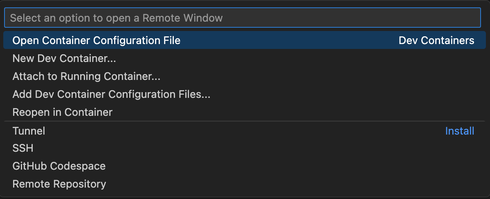

# AtCoder環境構築
Dockerを使い簡単に環境構築することができます。  
もし、エラーや不具合、要望があれば、issueを立ててください。

## 対応言語
C++  
Java     
Python(pypy)

## 対応予定
Rust  
Go

# 推奨IDE
VSCode
拡張機能を使うと簡単に作った環境にアクセスできるためおすすめです。

# 目次
- [Dockerのインストール](#dockerのインストール)
  - [Windowsの場合](#windowsの場合)
  - [Macの場合](#macの場合)
  - [Linuxの場合](#linuxの場合)
- [Gitのインストール](#gitのインストール)
- [VSCodeの設定](#vscodeの設定)
- [AtCoder環境へのアクセスの仕方](#atcoder環境へのアクセスの仕方)
- [問題解く時の流れ](#問題解く時の流れ)
- [各言語ごとの環境](#各言語ごとの環境)
    - [C++](#c)
    - [Java](#java)
    - [Python](#python)
- [VSCode以外を使う場合の流れ](#vscode以外を使う場合の流れ)
  - [コンテナ作成](#コンテナ作成)
    - [Mac or Linuxの場合](#mac-or-linuxの場合)
    - [Windowsの場合](#windowsの場合)
  - [コンテナ操作](#コンテナ操作)

# Dockerのインストール
Dockerというものを使って環境構築をしていきます。  
もし、インストールをしていない場合はDockerDesktopのインストールをしてください。

## Windowsの場合
[こちら](https://docs.docker.com/docker-for-windows/install/)からダウンロードしてください。

## Macの場合
[こちら](https://docs.docker.com/docker-for-mac/install/)からダウンロードしてください。

## Linuxの場合
[こちら](https://docs.docker.com/engine/install/)からダウンロードしてください。

# Gitのインストール
もしgitの環境構築はまだの場合は、インストールしてください。

# VSCodeの設定
まず、VSCodeを開きDev Containersという拡張機能を入れてください。　
https://marketplace.visualstudio.com/items?itemName=ms-vscode-remote.remote-containers

# AtCoder環境へのアクセスの仕方
まず、ターミナルやコマンドプロンプトを開き
```bash
git clone https://github.com/thirdlf03/setup-atcoder.git
```
と入力してください。

その後、DockerDesktopを起動。
次に、VSCodeを開きフォルダーを開くでsetup-atcoderのフォルダの中に色々な言語があるので、自分の使いたい言語のフォルダーを開いてください。

そうすると右下の方に

というボタンが出てくるので、Reopen in Containerをクリックしてください。

すると、VSCodeが再起動し、コンテナが作成されます。

これで、環境構築が完了です。

# 問題解く時の流れ
この環境にはatcoder cliとonline-judge-toolsが入っています。  
まず、ログインしましょう。  
VSCodeのターミナルを開き
```bash
acc login
oj login https://atcoder.jp/
```
でそれぞれ、名前とパスワードを聞かれるのでログインしましょう。

次に、解きたい問題のテストコードを用意していきます。
```bash
acc new 解きたい問題
```

例えば、abc200の問題を解きたい場合は
```bash
acc new abc200
```
と入力してください。

すると、左側のフォルダーにabc200というフォルダーが作成され、
それをクリックすると問題番号が書かれたフォルダーができるので、その中にあるMain~~ってファイルにコードを書いていきます。

コードを書き終わったら、テストをしていきます。

例えば、abc200のa問題を解いた場合は
```bash
cd abc200
cd a
```
と入力した後

```bash
ojt
```
と入力してください。

すると、テストができます。

テストが通ったら、提出をしていきましょう。

```bash
acs
```
と入力すると提出が始まります。  
ターミナルに  
Are you sure? Please type "abca"  
と出たら、abcaと入力してください。  

するとVSCodeがURLを開くか聞いてきます。
もし、提出の結果が見たい場合は、URLを開いてください。

これで、問題を解く流れが完了です。

次の問題に移る場合は
```bash
cd ..
```
と入力した後

```bash
cd b
```
の用意に移動してテストや提出を行なってください。

# テンプレートファイルを変更
acc newをした時にできるMain~~ファイルのテンプレートを変更することができます。
変更する場合は、setup-atcoderのフォルダの中にある各言語のフォルダの中にあるMainファイルを編集した後  
画面左下の方にある  
  
このボタンをクリックしてください。  
すると画面の中央上部に以下のような画面が出てくるので、Rebuild Containerをクリックしてください。

すると次acc new するときに反映されます。

# 各言語ごとの環境

## C++
gcc 12.3  
g++ 12.3    
atcoder cli    
online-judge-tools

## Java
openjdk 17    
atcoder cli    
online-judge-tools

## Python
CPython 3.11.4  
PyPy 3.10-v7.3.12  
atcoder cli  
online-judge-tools


# VSCode以外を使う場合の流れ

# コンテナ作成
## Mac or Linuxの場合
まず、Dockerの起動(DockerDesktopの起動)とこのレポジトリをcloneしてください。  ```bash  
git clone https://github.com/thirdlf03/setup-atcodercd setup-atcoder```

その後、ターミナルで
```bash  
chmod +x ./setup.sh && ./setup.sh  
```  
を実行し、自分が構築したい言語を選んでください。(現在C++のみ)

セットアップ完了と出るとコンテナが完成しています


## Windowsの場合
まず、Docker(DockerDesktopの起動)の起動とこのレポジトリをcloneしてください。  ```bash  
git clone https://github.com/thirdlf03/setup-atcodercd setup-atcoder```  
自分の構築したい言語のディレクトリに移動します。  今回の場合、c++にしようと思います。  ```bash  
cd cpp```  
その後、以下のコマンドを実行してください。
```bash  
docker build -t cpp . && docker run -v ./workspace:/opt/workspace --tty --name atcoder_cpp_container -d cpp
```  


# コンテナ操作
コンテナに入りたい場合、ターミナルやコマンドプロンプトで
```bash  
docker exec -it atcoder_cpp_container /bin/bash
```  
と入力してください。　atcoder_言語名_container

入った後、
```bash  
cd /opt/workspace
```  
に移動してください

このworkspaceディレクトリが、cloneしてきたディレクトリの配下にあるcpp/workspaceのようなworkspaceと紐づいています。


もし、コンテナがストップしてしまった場合は
```bash  
docker container start atcoder_cpp_container
```  
で起動できます！  
